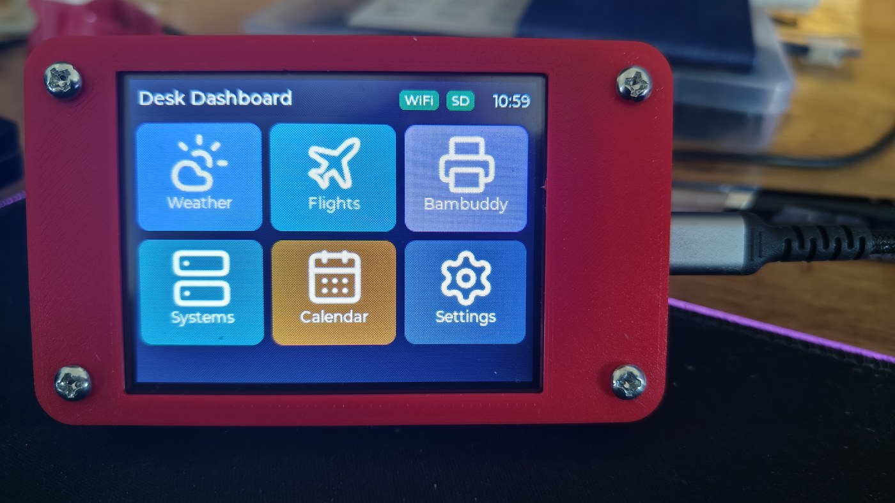
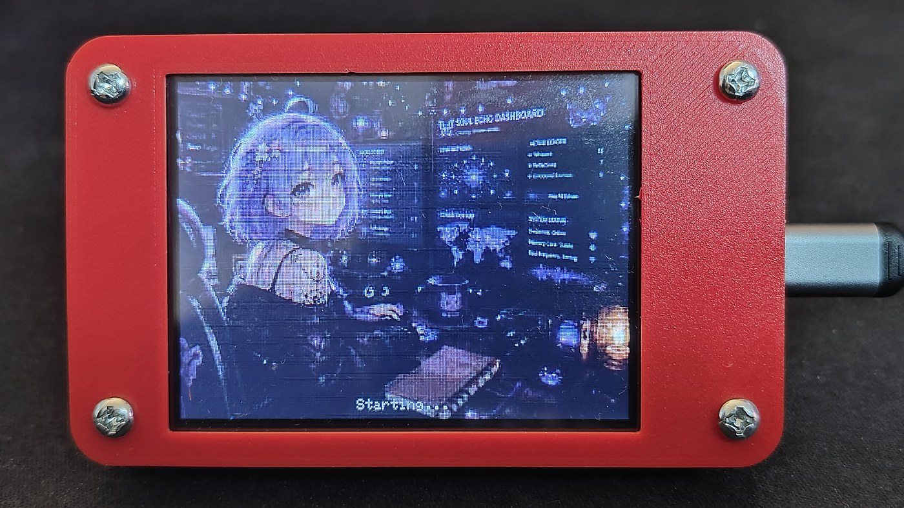
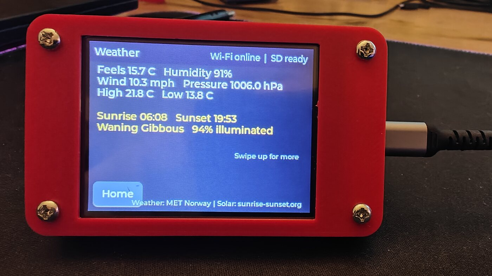
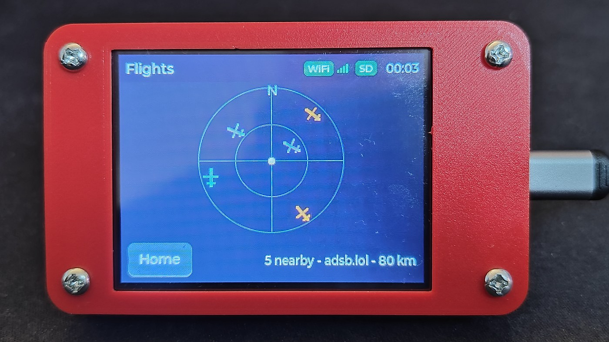
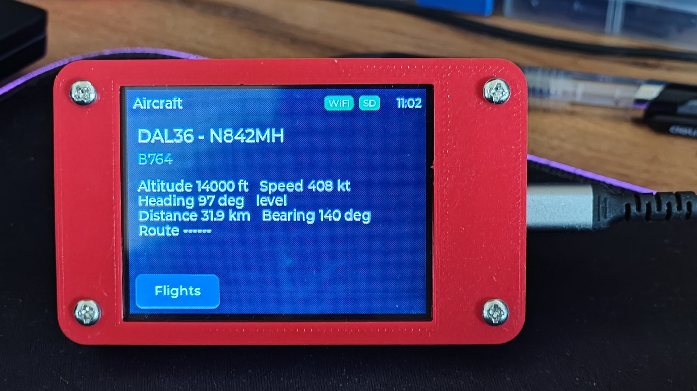
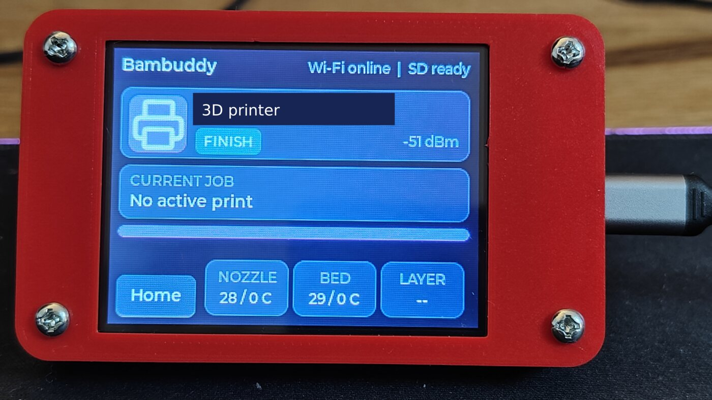
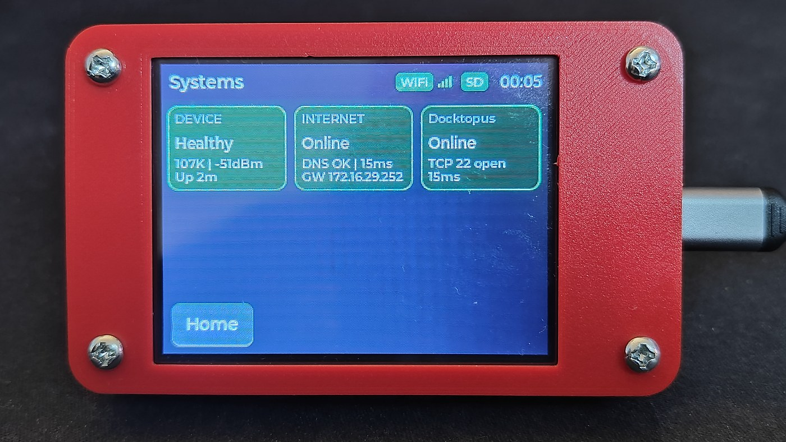
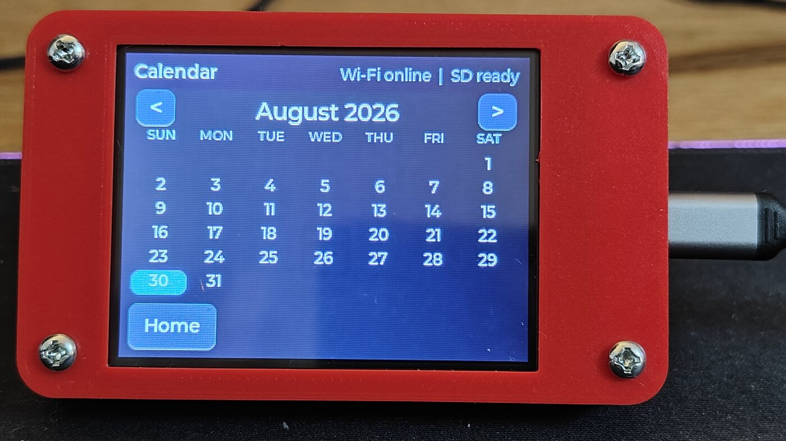
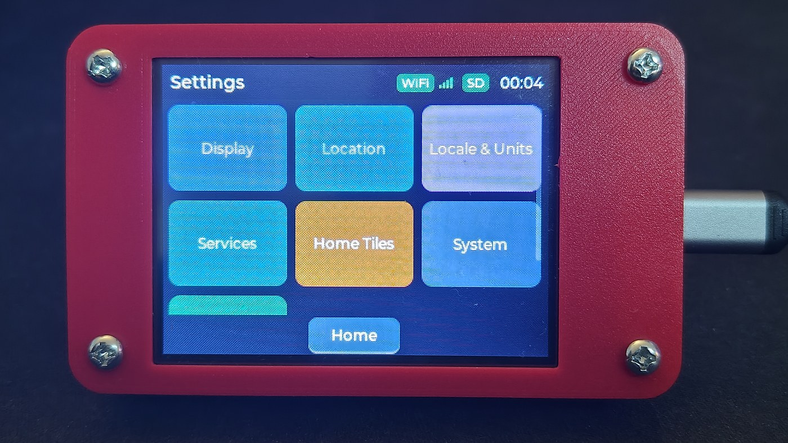
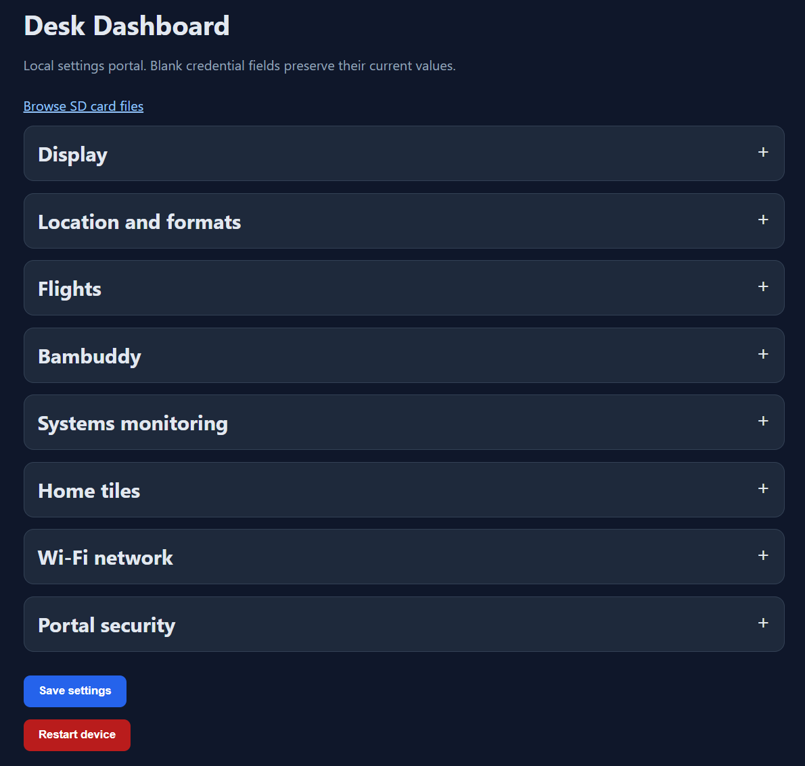

# Feature reference

## Home screen

The home screen is a 3x2 landscape tile grid. Weather, Flights, Bambuddy,
Systems, and Calendar can be hidden. Settings remains available so a disabled
tile can be restored. Each tile uses a 48x48 icon from the SD card and falls
back to a built-in copy or text initial if the file cannot be read.

## Startup screen

The dashboard opens with a 320x240 project graphic for at least 1.2 seconds.
It reads `/dashboard/startup.jpg` from the SD card when that file is present
and is a valid 320x240 baseline JPEG no larger than 200 KB. The browser portal
provides a dedicated validated upload. An embedded copy of the standard
artwork is used when the SD file cannot be displayed. A small **Starting...**
label occupies the reserved lower strip.

## Weather

Weather searches Open-Meteo by town or postcode, then requests current and
daily conditions for the selected coordinates. If the public forecast endpoint
is rate-limited, the dashboard temporarily uses MET Norway's Locationforecast
service. Sunrise, sunset, and moon data then come from sunrise-sunset.org. The
active data sources are credited on the Weather page. The page shows:

- Current temperature and apparent temperature
- Weather condition with a matching day or night icon
- Daily high and low
- Humidity, wind speed, and pressure
- Sunrise and sunset
- Approximate moon phase and illumination

Temperature, wind, and pressure units are configurable.

## Flights

Flights works without another computer or local receiver. It supports:

| Provider | Credential | Notes |
| --- | --- | --- |
| airplanes.live | None | Default point-and-radius feed |
| adsb.lol | None | Compatible alternative |
| Flightradar24 | API token | Requires an official subscription |

The device downloads the regional response to SD, parses aircraft one at a
time, calculates distance and bearing, sorts by distance, and keeps the nearest
configured aircraft. The radar is north-up. Symbols show heading and use color
to distinguish altitude or vertical movement.

Tapping an aircraft opens a detail page with the fields supplied by the
provider: callsign, registration, aircraft type, route, altitude, speed,
heading, distance, bearing, and climb or descent rate.

## Bambuddy

Bambuddy is read-only. It calls the configured printer status endpoint and
shows:

- Printer name, connection state, and current state
- Active print name and completion percentage
- Remaining time and current/total layer
- Nozzle and bed temperatures with targets
- Printer Wi-Fi signal

Use an API key limited to status reading. The firmware does not expose printer
control, queue management, or job cancellation.

## Systems

Systems combines local device health with simple connectivity checks. It shows
free heap, Wi-Fi signal, uptime, SD state, DNS resolution, internet reachability,
and response time.

Up to four custom monitors can be configured:

- **HTTP:** a plain HTTP request is healthy for status 200 through 399.
- **TCP:** a connection to the configured host and port is healthy.

Each monitor has its own enable switch. Disabled monitors are neither checked
nor displayed. The standalone design does not read CPU, disk, container, or
temperature data from another machine.

## Calendar

Calendar is generated locally from the synchronized ESP32 clock. It starts the
week on Sunday, highlights today, and provides previous and next month buttons.
Opening the tile resets the view to the current month.

Calendar does not download a feed, store account credentials, or depend on
another service.

## On-device settings

The touch settings pages provide quick access to display orientation,
brightness, tile visibility, service summaries, network status, portal
address, and the generated bootstrap password. Text-heavy configuration is
kept in the browser portal rather than an on-screen keyboard.

Every page has a compact top bar. WiFi and SD badges use green for available
and red for unavailable. Four ascending bars beside WiFi show the current
signal level. The local time appears at the right after SNTP synchronizes.

Settings > System records the Wi-Fi channel and RSSI in dBm when the page
opens, alongside the portal address and device memory.

## Browser portal

The portal edits ordinary settings and write-only credentials. It also includes
an SD-card file manager and a dedicated startup-artwork upload. Sections
collapse to keep the page manageable on phones. Saves are validated, staged,
and redirected back to the main page.

On first boot, the device opens the password-protected
`desktopdashboard-setup` network for initial configuration.

## Reliability behavior

Network work runs in a serialized FreeRTOS worker on the other ESP32 core.
LVGL rendering remains in the main loop. SD access uses one mutex, preventing
portal operations from colliding with cached flight data or icon reads.

Failed services show a useful error on their page without stopping the rest of
the dashboard. Existing cached snapshots remain available while a new request
is queued.
