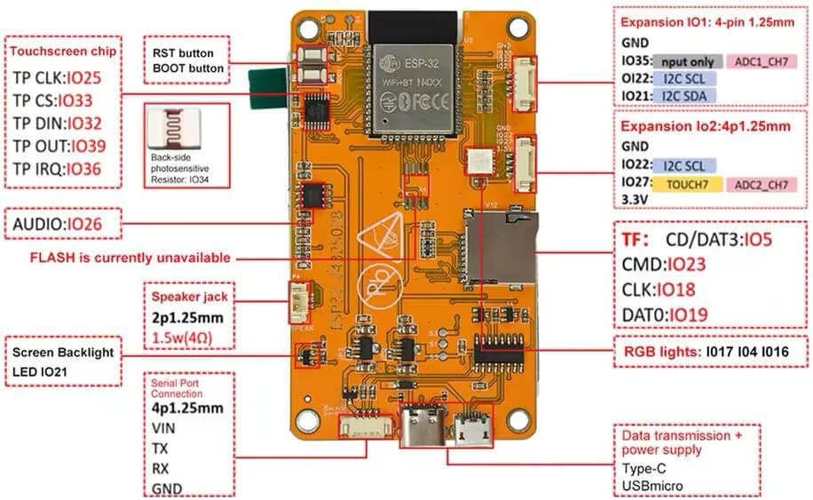
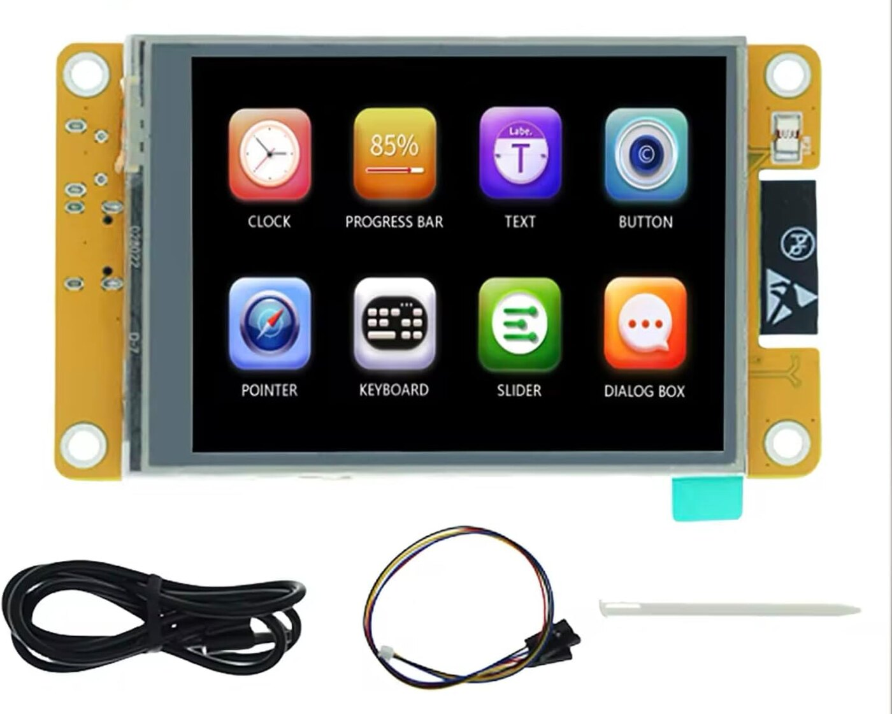
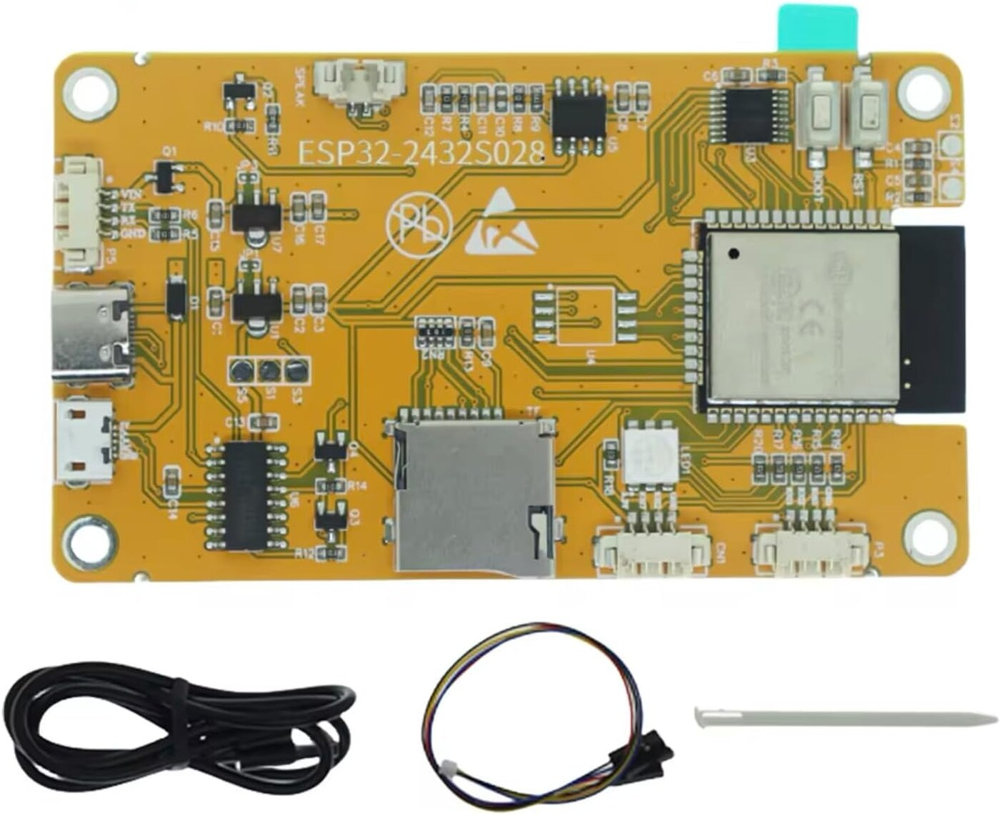

# Hardware

## Tested target

| Item | Tested configuration |
| --- | --- |
| Board | [ESP32-2432S028-class CYD](https://link.amazon/B0e12EwEV) (affiliate link) |
| ESP32 | ESP32-D0WD-V3 |
| Display | 2.8-inch ILI9341, 320x240 |
| Touch | XPT2046 resistive controller |
| Flash | 4 MB, DIO at 80 MHz |
| PSRAM | None |
| Storage | FAT32 microSD |
| USB bridge | CH340 |

The firmware uses the generic PlatformIO `esp32dev` board definition with a
custom LovyanGFX panel configuration.

## Board views

The tested hardware is the ESP32-2432S028 board shown in the linked
[Amazon product listing](https://link.amazon/B0e12EwEV). The front carries the
2.8-inch resistive touchscreen.

The rear view shows the ESP32 module, microSD slot, USB connectors, expansion
headers, audio connector, and the reset and boot buttons.

The labelled reference below identifies the exposed connectors and commonly
used GPIO assignments. Seller diagrams can vary between board revisions, so
the tested pin table and `firmware/include/lgfx_cyd.h` remain authoritative for
this firmware.

## Pin use

| Function | Pins |
| --- | --- |
| Backlight | GPIO 21 |
| SD CS | GPIO 5 |
| SD SCLK | GPIO 18 |
| SD MISO | GPIO 19 |
| SD MOSI | GPIO 23 |
| Touch CS | GPIO 33 |
| Touch IRQ | GPIO 36 |
| Touch clock | GPIO 25 |
| Touch MOSI | GPIO 32 |
| Touch MISO | GPIO 39 |

The display uses one hardware SPI controller and the SD card uses the other.
Touch runs over software SPI because this board routes the three peripherals to
different pin groups.

## Power and networking

Use a stable 5 V USB supply. Wi-Fi is 2.4 GHz only. Weak power or a charge-only
USB cable can look like random resets, failed uploads, or a board that never
appears as a serial port.

## Compatibility

CYD boards are sold under several names and revisions. Before flashing a
different revision, compare its display controller, touch controller, SD pins,
backlight pin, flash size, and USB bridge with the table above. A mismatched
panel definition can produce a white screen even when the firmware is running.
