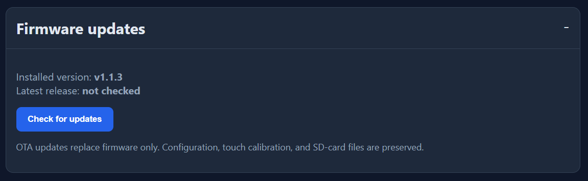

# Over-the-air updates

The dashboard can update its application firmware without a USB cable. OTA is
available in firmware `v1.1.0` and later, from the touchscreen or the browser
portal. Configuration, touch calibration, portal credentials, and files on the
microSD card are preserved.

OTA replaces only `firmware.bin`. A release that changes the bootloader,
partition table, or `boot_app0.bin` needs a full USB flash.

## Install an update from the touchscreen

1. Keep the dashboard connected to stable power and Wi-Fi.
2. Open **Settings > Firmware**.
3. Tap **Check for updates**.
4. Compare the installed version with the latest stable release.
5. Tap the install control and confirm the update.
6. Leave the device powered while it downloads, verifies, and writes the image.
7. Wait for the dashboard to restart and return to the Home screen.
8. Open **Settings > Firmware** again and check that the installed version has
   changed.

When the installed version is already current, the install control becomes
**Reinstall current release**. This follows the same verification and restart
process.

## Install an update from the browser portal

1. Open the dashboard address shown under **Settings > System**, then sign in.
2. Expand **Firmware updates**.
3. Select **Check for updates**.
4. Review the installed and latest versions.
5. Select the install or reinstall control and accept the browser confirmation.
6. Keep the page open while the progress display advances. Do not remove power.
7. The dashboard restarts when the verified image has been written. Allow about
   20 seconds for Wi-Fi and the portal to return.
8. Reload the portal if the browser does not reconnect automatically.



The initial `Latest release: not checked` message is normal. No GitHub request
is made until **Check for updates** is selected.

## What the device verifies

The ESP32 retrieves the latest stable release from GitHub's
certificate-validated Releases API. That response supplies the release tag,
firmware URL, exact byte count, and SHA-256 digest. The binary is streamed into
the inactive OTA partition while its digest is calculated. The new partition
is selected only when both the final size and SHA-256 match the authenticated
metadata.

The previous application remains in the other OTA slot. After restart, the new
firmware marks itself valid only after startup has completed. If it crashes or
restarts before that checkpoint, the rollback-enabled bootloader can return to
the prior image.

## Publish an OTA release

These steps are for repository maintainers. Stable OTA versions use
`vMAJOR.MINOR.PATCH`, for example `v1.1.3`. A tag containing a suffix is
published as a prerelease and is not returned by GitHub's latest stable release
API.

1. Set the new version in
   `firmware/include/firmware_version.h`.
2. Update documentation for the user-visible change.
3. Build and run the checked-in validation tools:

   ```bash
   python tools/check_examples.py
   python tools/generate_sbom.py --check
   pio run --project-dir firmware --environment cyd
   ```

4. Record the tested local binary in `firmware/BUILD-INFO.txt`:

   ```bash
   stat -c '%s' firmware/.pio/build/cyd/firmware.bin
   sha256sum firmware/.pio/build/cyd/firmware.bin
   ```

5. Test the build on the physical no-PSRAM CYD. Check the changed screen, Wi-Fi,
   SD access, portal access, and serial output.
6. Commit and push the source.
7. Create an annotated tag that exactly matches `FIRMWARE_VERSION`, then push
   it:

   ```bash
   git tag -a v1.1.3 -m "v1.1.3"
   git push origin main
   git push origin v1.1.3
   ```

8. Wait for the **Release firmware** GitHub Actions workflow. It builds from the
   tag and publishes `firmware.bin`, the complete USB-flash image set,
   `ota-manifest.json`, `SHA256SUMS`, the SBOM, and provenance attestations.
9. Confirm that the release is public and is neither a draft nor a prerelease:

   ```bash
   gh run list --workflow release.yml --limit 1
   gh release view v1.1.3
   ```

10. On a device running the previous release, use the normal OTA controls to
    install the new version. This final test covers the release metadata,
    GitHub download path, inactive-partition write, reboot, and version report.
11. Confirm the new version through the firmware screen and the health endpoint:

    ```bash
    curl http://DEVICE-IP/health
    ```

    The response should contain the new version, for example
    `"version":"v1.1.3"`.

GitHub release tags are immutable in practice. If a published image has a
problem, fix it under a new version rather than moving or replacing the old
tag.

## If an update fails

An update-check error does not alter the installed firmware. Confirm internet
access, DNS, synchronized time, and free heap on the Systems page, then try
again after other network requests have finished.

A failed size check, digest mismatch, interrupted download, or flash-write
error leaves the current application selected. Restart the dashboard and retry
from stable power and Wi-Fi. If the device boots the new image but cannot
complete startup, the bootloader can roll back on the next boot.

Use USB recovery when the device no longer reaches the interface, when both OTA
slots are unusable, or when a release changes the bootloader or partition
layout. Follow the full image offsets in [Releases](../RELEASES.md).
