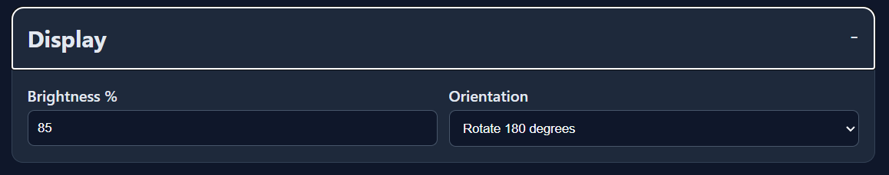
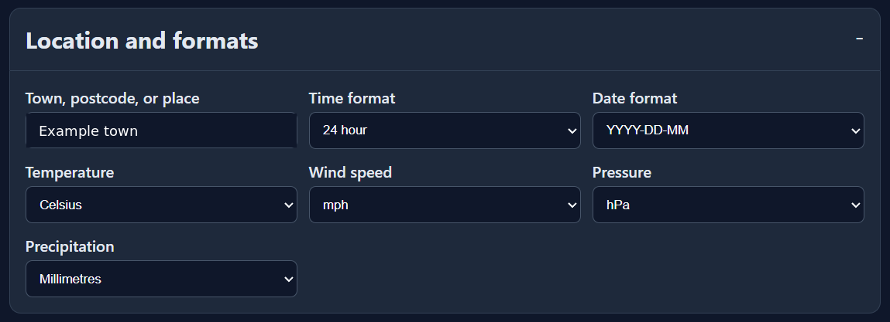
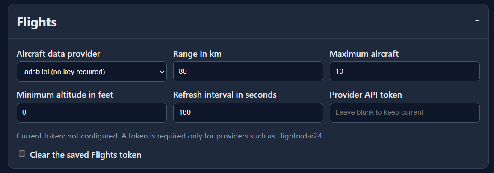
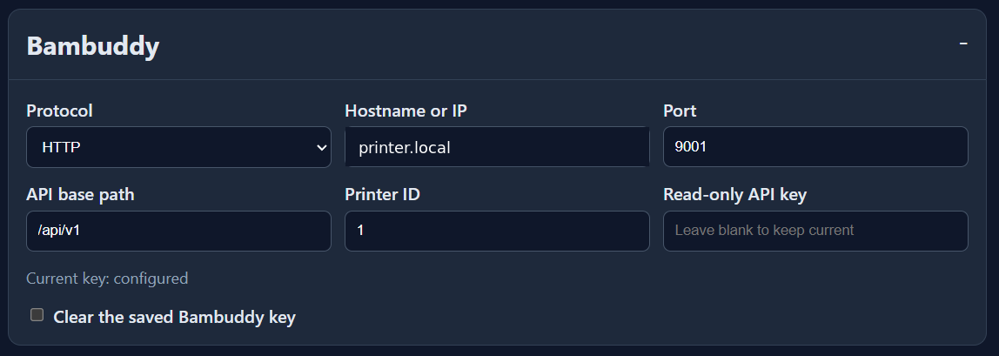
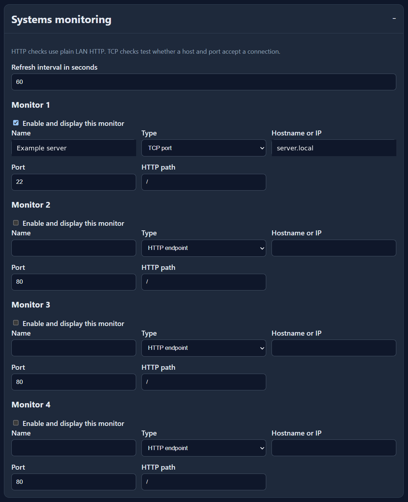
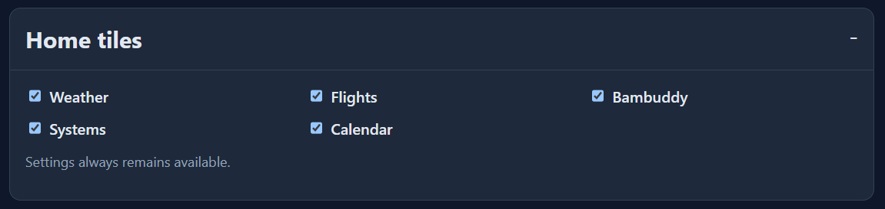
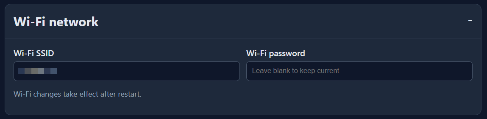
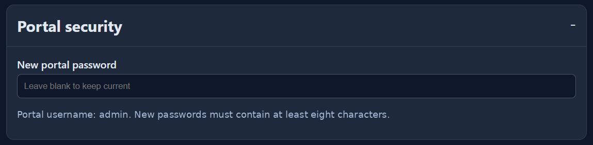
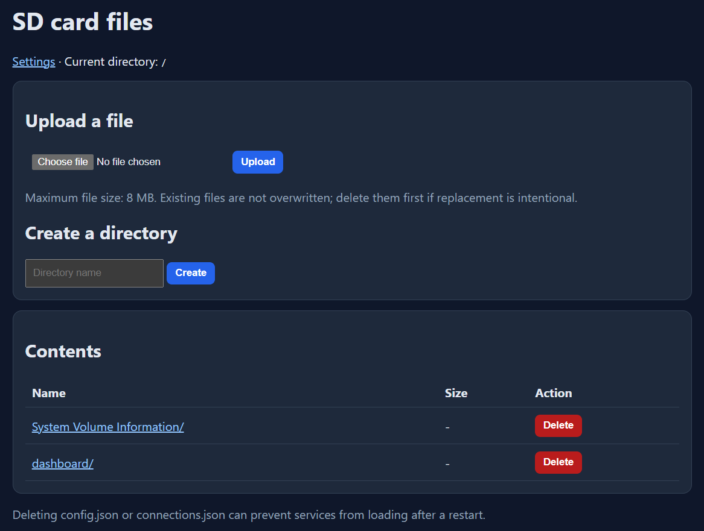

# Browser portal

## Access

The portal starts after Wi-Fi connects. Open the IP shown under
**Settings > System** or `http://desk-dashboard.local/`.

Authentication uses HTTP Basic Auth:

| Field | Value |
| --- | --- |
| Username | `admin` |
| Password | Value from `connections.json`, or the bootstrap password shown on the device |

The portal is intended for a trusted LAN. It does not provide HTTPS.

## Settings sections

### Display

Set brightness from 5 to 100 percent and choose normal or 180-degree rotation.
Changing rotation schedules a restart and requires touch recalibration.

### Location and units

Enter a town or postcode and choose 12/24-hour time, date format, temperature,
wind, pressure, and precipitation units. Location changes are resolved during
the next weather update.

### Flights

Choose airplanes.live, adsb.lol, or Flightradar24. Set the radius, maximum
aircraft, minimum altitude, refresh interval, and optional provider token.

### Bambuddy

Set the HTTP host, port, API base path, printer ID, and read-only key. Blank
credential fields preserve the current value. The existing key is never sent
back to the browser.

### Systems

Set the refresh interval and configure up to four HTTP or TCP checks. Each
monitor has an enable checkbox, name, host, port, and HTTP path.

### Home tiles

Show or hide Weather, Flights, Bambuddy, Systems, and Calendar. Settings cannot
be hidden.

### Wi-Fi and portal security

Set the Wi-Fi SSID and password, then change the portal password. New portal
passwords must contain at least eight characters.

## Save behavior

The form includes a per-boot token. The firmware validates numeric ranges and
known option values before writing. It creates stage and backup files, replaces
both JSON documents as one operation, and recovers interrupted saves during the
next boot.

A successful save redirects to the portal root rather than leaving the browser
on `/save`. Wi-Fi or rotation changes schedule a restart.

The manual restart page waits 15 seconds, then returns the browser to the portal
root after the device has had time to boot.

## SD file manager

Select **Browse SD card files** to:

- Browse directories
- Download a file
- Upload a file up to 8 MB
- Create a directory
- Delete one file or an empty directory

Uploads do not silently overwrite existing files. Paths containing traversal
components are rejected. Recursive deletion is intentionally unavailable.

## Health endpoint

`/health` returns a small unauthenticated status response suitable for checking
whether the portal task is alive. It does not expose credentials.
